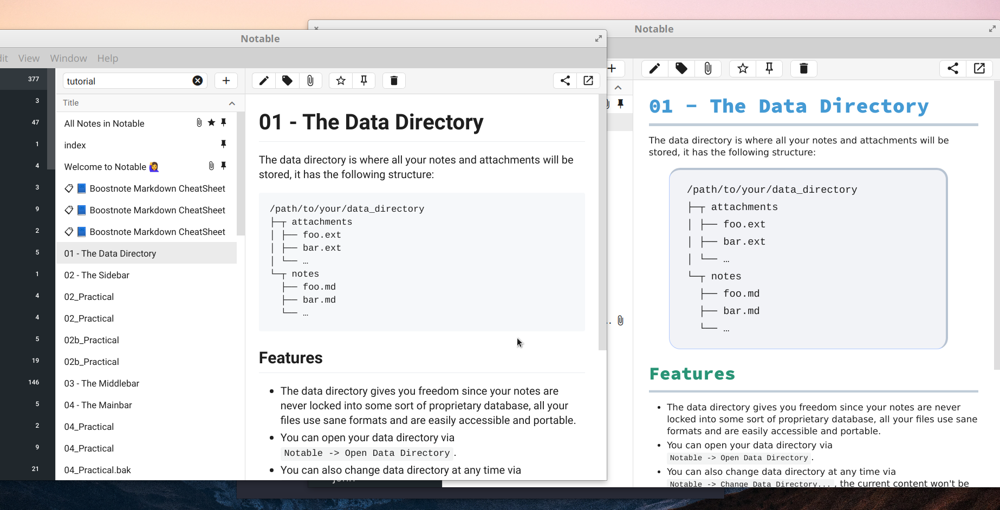

#  Custom CSS in Notable
> Tue 21 Jan 2020 08:20:34 PM 

Custom CSS can be used in Notable by using the `! important` specification in the CSS.

First download and extract the `.AppImage` with: [^1]

```bash
wget https://github.com/notable/notable/releases/download/v1.8.3/Notable-1.8.3.AppImage
chmod +x ./Notable-1.8.3.AppImage
./Notable-1.8.3.AppImage --appimage-extract
```

Make sure that you've set up `npm` globally with [nvm](https://github.com/nvm-sh/nvm#install--update-script), in order to start using the newest `node` execute:

```bash
exec bash
curl -o- https://raw.githubusercontent.com/nvm-sh/nvm/v0.35.2/install.sh | bash
nvm install node
nvm use node
```

Install the `asar` tool with: [^2]

```bash
npm install -g asar
```

Traverse into the directory, make a subdirectory and extract by using the `extract` parameter: [^3]

```bash
cd squashfs-root/resources/ ; mkdir extractedAppAsar
asar extract app.asar extractedAppAsar/
 cd extractedAppAsar/
```

This should give you something to the effect of:

```
.
├── main
│   ├── chunk.0c2c065610c5339dc3ff.js
│   ├── main.js
│   └── main.js.LICENSE
├── package.json
├── renderer
│   ├── 0.renderer.css
│   ├── 11.renderer.css
│   ├── 1.renderer.css
│   ├── chunk.0bcec0fa00f9b8c09b9f.js
│   ├── fonts
│   │   ├── KaTeX_AMS-Regular--fonts.woff2
│   ├── index.html
│   ├── renderer.css
│   ├── renderer.js
│   └── renderer.js.LICENSE
└── static
    ├── images
    │   ├── icon.ico
    │   ├── icon.png
    │   └── pointing-clips.svg
    ├── metadata.json
    ├── monaco.worker.js
    ├── quick_modals.json
    └── tutorial.json
```

Now open your css and replace every `;` character with `! important;`and/or play around in notable until you make something you're happy with, save this css into the directory as `mystyle.css`. [^vim]

here's some really obvious `css` that you can use to test with:

```bash
echo "pre { background: #282a36 ; background:  #809cb8  !important; font-weight: 550; border: 3px solid #75327a; font-size: 18px !important; line-height: 21px !important; overflow: auto; padding: 20px 40px !important; border-radius: 20px !important; color: #2d4d6d !important ; }" >> mystyle.css
```

Append this to `renderer.css`:

```bash
cat mystyle.css >> renderer/renderer.css
```

Then rebuild it with:

```bash
cd ..
rm app.asar
asar pack extractedAppAsar
```

Now before repacking the AppImage I would recommend testing it by running:

```bash
./AppRun
```

If it worked the app should just pop up and the CSS should be different, if not something's wrong on your end. 

Then repackage the  `AppImage` by using the [appimagetool](https://docs.appimage.org/introduction/software-overview.html#ref-appimagetool): [^stack]

```bash
cd ../../../
wget https://github.com/AppImage/AppImageKit/releases/download/continuous/appimagetool-x86_64.AppImage
chmod +x appimagetool-aarch64.AppImage 
./appimagetool-aarch64.AppImage -v squashfs-root
```

Then test run the app executing it:

```bash
 mv ./Notable-x86_64.AppImage MyCssNotable.AppImage
 ./MyCssNotable.AppImage 
```

### My Style

A style I was happy with was:




```css
<style>
pre {
    background: #292B2E ;
    border-top: 4px solid rgba(53,86,129, 0.3) ! important;
    border-right: 4px solid rgba(53,86,129, 0.3) ! important;
    background:  rgba(0, 0, 100, 0.05) ! important;
    font-weight: 100;
    /*border: 2px solid #ECECEC;*/
    border: 1px solid #b3c6ff;
    margin-left: 2em ! important ;
    margin-right: 3em ! important ;
    font-size: 18px !important;
    line-height: 30px !important;
    overflow: auto;
    padding: 20px 30px !important;
    border-radius: 20px !important;
      /* color: #ECECEC ! important ; */ /* Don't do this, use Transperancy alpha */
    font-family: Source Code Pro ! important;

}


html,body{
   margin: 50 em ! important;
   font-family: DejaVu Sans ;
    font-size: 18px ! important;
}


h1 {
    font-size: 36px ! important;
    line-height: 40px! important;
     font-family: Source Code Pro Black ! important;
     color: #4F97D7 ! important;
     border-bottom: 5px solid rgba(53,86,129, 0.3) ! important;
}

h2 {
    font-size: 32px! important;
    line-height: 40px! important;
     font-family: Source Code Pro Black ! important;
     color: #2D9574 ! important;
     border-bottom: 4px solid rgba(53,86,129, 0.3) ! important;
     		
}

h3 {
    font-size: 30px! important;
    line-height: 40px! important;
     font-family: Source Code Pro Black ! important;
     color: #67AF20 ! important;
     	border-bottom: 3px solid rgba(53,86,129, 0.3) ! important;
}

h4 {
    font-size: 28px! important;
    line-height: 20px! important;
    color: #B1951D ! important;
    font-family: Source Code Pro Semibold ! important;
    border-bottom: 0px dotted rgba(53,86,129, 0.3) ! important;
    
}

/* Won't be used here */

h5 {
    font-size: 26px! important;
    line-height: 20px! important;
  color: #4F97D7 ! important;
  font-family: Source Code Pro Semibold  ! important;
  border-bottom: 0px dotted rgba(53,86,129, 0.3) ! important;

}

h6 {
    font-size: 24px! important;
    line-height: 20px! important;
      color: #2D9574 ! important;
      font-family: Source Code Pro ! important;
}

</style>
```


This `.AppImage` can then be integrated into your system by followint [the documentation](https://docs.appimage.org/user-guide/run-appimages.html#integrating-appimages-into-the-desktop).

[^1]: [App Image user Guide](https://docs.appimage.org/user-guide/run-appimages.html#mount-or-extract-appimages) 
[^2]: [Electron Tutorial](https://electronjs.org/docs/tutorial/application-packaging)

[^3]: [Akash Nimari, How to get source code of any electron application](https://medium.com/how-to-electron/how-to-get-source-code-of-any-electron-application-cbb5c7726c37)

[^vim]: in [Vim](https://neovim.io) I was able to just use `%s/;/! important;/g`, you may also want to use `sed` or [`sd`](https://github.com/chmln/sd)

[^stack]: [StackExchange](https://superuser.com/a/1389548)
